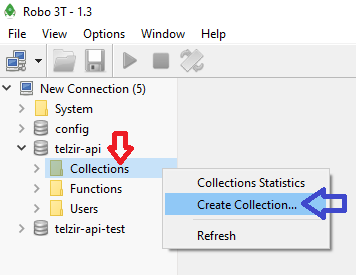

# TELZIR - Simulador de cálculo de ligações telefônicas (Backend em Node.js)

A API foi implementada utilizando os seguintes recursos:

- [Node.js](https://nodejs.org/en/) 
- [MongoDB](https://www.mongodb.com/)
- [Mongoose](https://mongoosejs.com/)
- [Restify](http://restify.com/)
 
 Backend REST com implementação das operações básicas (listar, inserir, editar, excluir e alterar), bem como, alguns métodos diferenciados como o que realiza o cálculo da simulação telefônica.

 Observações:

1 - Foi utilizada a paginação com apenas dois itens, pois, devido a quantidade mínima de registros na base, se fez necessário para expor a funcionalidade de forma operacional (a consulta apresenta o elemento identificado por "_links" que irá conter, sempre que tiver sentido, a página atual, a próxima e a anterior).

2 - As seguinte entidades estão disponíveis na API (considerando que o server esteja disponível no endereço local http://localhost:3001):

> 1 - LOCALIDADES:
 
**(GET) Listagem geral:**
http://localhost:3001/localidades

Exemplo de response:

```json
{
    "_links": {
        "self": "/localidades",
        "next": "/localidades?_page=2"
    },
    "items": [
        {
            "_id": "5e56d546bbb50425806e7de4",
            "ddd": "011",
            "__v": 0
        },
        {
            "_id": "5e56d54bbbb50425806e7de5",
            "ddd": "016",
            "__v": 0
        }
    ]
}
```
Exemplo de url para acessar a segunda página:
http://localhost:3001/localidades?_page=2


**(GET) Localidade específica por ID (sendo o ID de exemplo 5e56d546bbb50425806e7de4):**
http://localhost:3001/localidades/5e56d546bbb50425806e7de4

Exemplo de response:
```json
{
   "_links":{
      "self": "/localidades/5e56d546bbb50425806e7de4"
    },
    "_id": "5e56d546bbb50425806e7de4",
    "ddd": "011",
    "__v": 0
}
```

**(POST) Inserir uma nova localidade:**
http://localhost:3001/localidades

Exemplo de request:
```json
{
  "ddd": "018" 
}
```

Exemplo de response com sucesso:
```json
{
    "_links":{
        "self": "/localidades/5e5d617811096d34a81ac128"
    },
    "_id": "5e5d617811096d34a81ac128",
    "ddd": "021",
    "__v": 0
}
```

Exemplo de response com erro (são executadas algumas validações de acordo com a entidade, por exemplo, ao enviar um request com o valor "ddd": "0211", temos uma violação de tamanho):
```json
{
    "message": "Validation error while processing your request",
    "errors":[
        {
           "name": "ddd",
           "message": "Path `ddd` (`0211`) is longer than the maximum allowed length (3)."
        }
    ]
}
```
Esta mesma estrutura de apresentação é utilizada em todos os serviços (para o caso de mais de um erro, o elemento "errors" irá apresentar toda a lista de ocorrências).

**(PATCH) Realiza uma atualização com sobreposição total do elemento, ou seja, campos não informados serão eliminados:**
http://localhost:3001/localidades/5e5d617811096d34a81ac128

Observação: Para manter o padrão RESTful a mensagem deve ser enviada considerando o seguinte (porém o padrão application/json também foi mantido):
Content-Type: application/merge-patch+json

**(PUT) Realiza uma atualização com merge dos dados, ou seja, os campos não informados são mantidos com os valores originais:**
http://localhost:3001/localidades/5e5d617811096d34a81ac128

**(DEL) Realiza uma exclusão, removendo completamente o registro indicado:**
http://localhost:3001/localidades/5e5d617811096d34a81ac128


> 2 - PLANOS:
 
**(GET) Listagem geral:**
http://localhost:3001/planos

Exemplo de response:
```json
{
    "_links": {
        "self": "/planos",
        "next": "/planos?_page=2"
    },
    "items": [
        {
            "_id": "5e56d699bbb50425806e7de8",
            "origem": { "_id": "5e56d546bbb50425806e7de4", "ddd": "011", "__v": 0 },
            "destino": { "_id": "5e56d54bbbb50425806e7de5", "ddd": "016", "__v": 0 },
            "valor": 1.9,
            "__v": 0
        },
        {
            "_id": "5e56d6b4bbb50425806e7de9",
            "origem": { "_id": "5e56d54bbbb50425806e7de5", "ddd": "016", "__v": 0 },
            "destino": { "_id": "5e56d546bbb50425806e7de4", "ddd": "011", "__v": 0 },
            "valor": 2.9,
            "__v": 0
        }
    ]
}
```

**(POST) Inserir um novo plano:**
http://localhost:3001/planos

Exemplo de request:
```json
{
  "origem": "5e56d554bbb50425806e7de7", "destino": "5e56d546bbb50425806e7de4", "valor": "1.90"
}
```
Demais métodos seguem o padrão já apresentado em Localidades.


> 3 - PRODUTOS:
 
**(GET) Listagem geral:**
http://localhost:3001/produtos

Exemplo de response:
```json
{
    "_links": {
        "self": "/produtos",
        "next": "/produtos?_page=2"
    },
    "items": [
        {
            "_id": "5e56d836bbb50425806e7dee",
            "descricao": "FaleMais 30",
            "minutos": 30,
            "acrescimo": 10,
            "__v": 0
        },
        {
            "_id": "5e56d849bbb50425806e7def",
            "descricao": "FaleMais 60",
            "minutos": 60,
            "acrescimo": 10,
            "__v": 0
        }
    ]
}
```

**(POST) Inserir um novo plano:**
http://localhost:3001/produtos

Exemplo de request:
```json
{
  "descricao": "FaleMais 120", "minutos": "120", "acrescimo": "10"
}
```
Demais métodos seguem o padrão já apresentado em Localidades.


##Métodos diferenciados:

**(GET - Localidades) Realiza a busca de todas as localidades destino relacionadas a um determinado ID de uma origem:**
http://localhost:3001/localidades/byOrigem/:origem
Exemplo:
http://localhost:3001/localidades/byOrigem/5e5d617811096d34a81ac128


**(GET - Planos) Busca um determinado plano utilizando como filtro as localidades de origem e destino:**
http://localhost:3001/planos/byorigemdestino/:origem/:destino
Exemplo:
http://localhost:3001/planos/byorigemdestino/5e5017c5e1ec050c4736d801/5e5017b5e1ec050c4736d7fd


**(GET - Produtos) Realiza a simulação do cálculo de custo de minutos:**
http://localhost:3001/produtos/simular/:produto/:origem/:destino/:duracao
Exemplo:
http://localhost:3001/produtos/simular/5e56d836bbb50425806e7dee/5e56d546bbb50425806e7de4/5e56d550bbb50425806e7de6/40


## Instalação (ambiente/execução)

Para iniciar a utilização da API REST é necessário o seguinte:

- Instalar o [MongoDB](https://www.mongodb.com/download-center/community)

Após a instalação, criar na raiz da máquina o diretório data e dentro do mesmo outro denominado db (com permissões de acesso, neste diretório será criada a base de dados do mongo):
Base utilizada: mongodb://localhost/telzir-api

```shell
  data/db
```

Após isto, vá até na pasta de instalação do mongo e entre no diretóro bin (exemplo na instalação padrão windows):

```shell
  C:\Program Files\MongoDB\Server\4.2\bin
```
Dentro da pasta bin irá encontrar o arquivo "mongod", execute o mesmo para subir uma instancia do banco que será utilizada pela aplicação (mantenha aberta a janela que irá surgir).

- Instalar o Node.js, [instruções](https://nodejs.org/en/download/).

- Após instalado, abrir um console na raiz do projeto e digitar:

  * Instalar o [Typescript](https://www.npmjs.com/package/typescript/v/3.6.4) com:
  ```shell
    npm install -g typescript
  ```

  * Instalar o [Nodemon](https://www.npmjs.com/package/nodemon) com:
  ```shell
    npm install -g nodemon
  ```

  * Instalar as dependencias do projeto com:
  ```shell
   npm install
   ```

  * Abrir um novo console na raiz do projeto e executar o seguinte comando (mantenha a janela aberta, o mesmo é responsável por identificar alterações no código typescript e gerar o correspondente em javascript):
  ```shell
   tsc -w
   ```

  * Abrir outro novo console na raiz do projeto e executar o seguinte comando (mantenha a janela aberta, o mesmo é responsável por rodar o código javascript gerado com o comando acima, disponibilizando o server para as operações):
  ```shell
   nodemon ./dist/main.js
   ```


## Execução dos testes

Considerando que o ambiente já esteja configurado conforme instruções anteriores, digite o seguinte em um console do projeto:

```shell
npm run test
```

Observação: É necessário que a instancia do mongoDb esteja ativa, pois, para a execução é criada uma base de testes **(mongodb://localhost/telzir-api-test)** real (não é utilizado mock).

A cada execução dos testes esta base de dados é zerada para garantir que não haja impacto nos resultados.

Os testes são executados na porta 3003 (diferente da execução normal que é 3001) para evitar qualquer conflito.


## Database

Os testes realizam as inserções e manipulações de dados automaticamente na base de teste, porém, para a execução normal, será necessário realizar a inserção das informações na base, para isto seguir as instruções:

Observação: Existem outras formas de realizar esta ação, executando diretamente em um shell do mongoDb, instalando uma extensão no chrome de acesso a API REST e utilizar os serviços, etc, porém, segue uma forma mais visual para a realização via ferramenta.

1 - Faça o download e instalação do [Robo 3T](https://robomongo.org/download)

2 - Considerando que a instancia do mongoDb esteja em execução, abra a ferramenta Robo 3T e realize a conexão com o banco de dados:


3 - Após conectar na base, clique com o botão direito sobre "New Connection" (seta azul), e na janela que abrir escolha "Create Database" (seta vermelha).


4 - Na janela que será exibida digite o nome da base de dados utilizada por padrão pela API, ou seja 'telzir-api'. Dentro da pasta common do projeto, no arquivo environments, as informações podem ser alteradas caso deseje criar a base com outra denominação.


5 - Na coluna da esquerda será exibida a base de dados 'telzir-api' criada, abra a mesma para visualizar as opções da treeView e clique com o botão direito sobre 'Collections' (seta vermelha), escolhendo na sequencia 'Create Collection...' (seta azul).


6 - Na janela que será exibida digite o seguinte nome de collection: 'localidades'.


6.1 - Repita o passo 6 para criar mais duas Collections, sendo:
1 - 'planos'
2 - 'produtos'

7 - Na relação lateral, ao expandir Collections, deve observar as 3 recentemente criadas, sendo: 'localidades', 'planos' e 'produtos'. Clique com o botão direito sobre localidades e escolha a opção 'Insert Document...':


8 - Na janela que se abre, digite a informação:
```shell
{
    "ddd": "011"
}
```
Depois clique em 'Save'.


8.1 - A localidade será inserida, repetir o mesmo procedimento para inserir mais 3 localidades:
```shell
{
    "ddd": "016"
}
```
```shell
{
    "ddd": "017"
}
```
```shell
{
    "ddd": "018"
}
```
9 - Reproduzir o passo 8 novamente, entretanto, para a collection 'produtos', inserindo os seguintes produtos, um de cada vez:
```shell
{
  "descricao": "FaleMais 30", "minutos": "30", "acrescimo": "10"
}
```
```shell
{
  "descricao": "FaleMais 60", "minutos": "60", "acrescimo": "10"
}
```
```shell
{
  "descricao": "FaleMais 120", "minutos": "120", "acrescimo": "10"
}
```

10 - Novamente irá repetir o passo 8, porém, para a collection 'planos', este tipo de documento é um pouco mais complexo que os anteriores, pois, tem em sua estrutura relacionamentos entre collections.

A estrutura que será inserida tem a seguinte formação:
```shell
{
"origem": "5e56d554bbb50425806e7de7", "destino": "5e56d546bbb50425806e7de4", "valor": "1.90"
}
```
Sendo que, a informação de origem e destino corresponde aos campos _ID gerados automaticamente quando as localidades foram inseridas.
Para visualizar estas informações, clique com o botão direito do mouse sobre a collection 'localidades' e escolha a opção 'View Documents'


11 - Na tela que será aberta serão exibidos os documentos anteriormente inseridos, clicando sobre os mesmos para expandir, os campos do documento ficarão visíveis.


Conforme destacado em vermelho, temos o campo _id, o qual apresenta a chave de relacionamento que será utilizada.

Siga o seguinte gabarito para realizar as inserções:

Considerando que a collection 'localidades tenha o seguinte resultado':
```shell
{
"_id": "5e56d546bbb50425806e7de4",
"ddd": "011",
"__v": 0
},
{
"_id": "5e56d54bbbb50425806e7de5",
"ddd": "016",
"__v": 0
[
{
"_id": "5e56d550bbb50425806e7de6",
"ddd": "017",
"__v": 0
},
{
"_id": "5e56d554bbb50425806e7de7",
"ddd": "018",
"__v": 0
}
```
Faça as substituições correspondentes e insira um a um os registros abaixo:

```shell
"origem": "5e56d546bbb50425806e7de4", "destino": "5e56d54bbbb50425806e7de5", "valor": "1.90"

"origem": "5e56d54bbbb50425806e7de5", "destino": "5e56d546bbb50425806e7de4", "valor": "2.90"

"origem": "5e56d546bbb50425806e7de4", "destino": "5e56d550bbb50425806e7de6", "valor": "1.70"

"origem": "5e56d550bbb50425806e7de6", "destino": "5e56d546bbb50425806e7de4", "valor": "2.70"

"origem": "5e56d546bbb50425806e7de4", "destino": "5e56d554bbb50425806e7de7", "valor": "0.90"

"origem": "5e56d554bbb50425806e7de7", "destino": "5e56d546bbb50425806e7de4", "valor": "1.90"
```

Após isto, os dados necessários para a correta utilização do sistema estarão disponíveis.